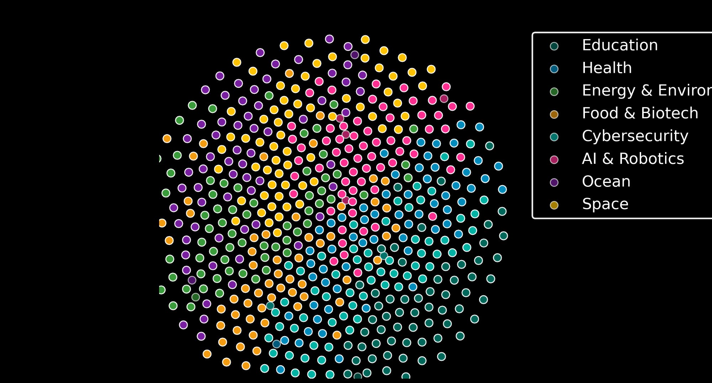
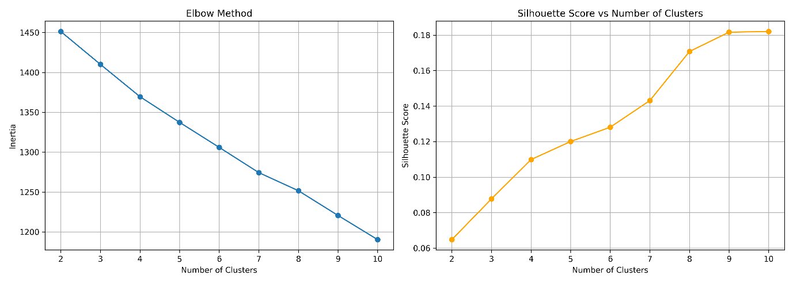
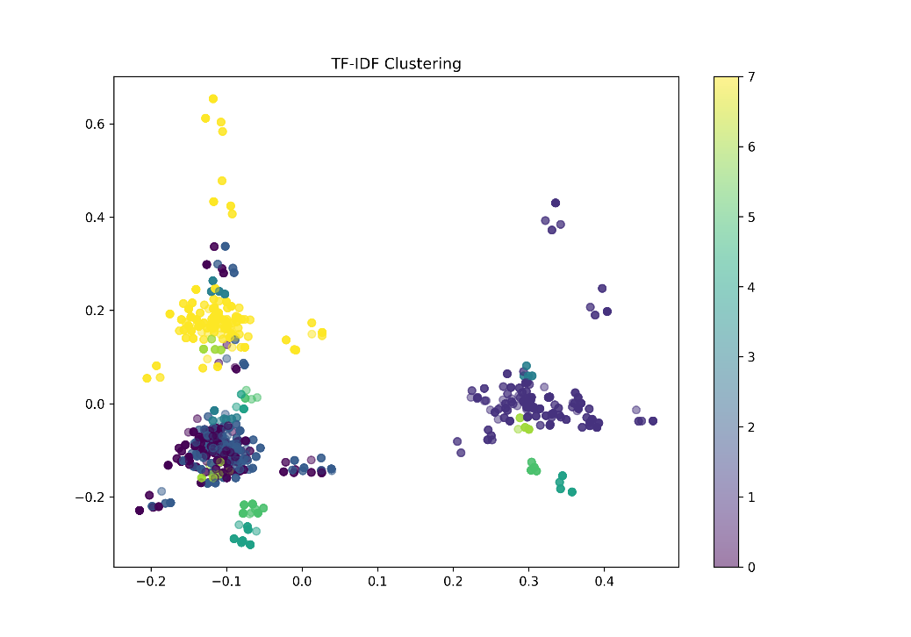

# Intelligent Idea Analysis Engine (IIAE)

**Live Demo:** [intelengine.streamlit.app](https://intelengine.streamlit.app/)

A semantic duplicate detection system for idea management at scale. Rather than relying on keyword matching, the IIAE analyzes the *meaning* of submitted ideas using deep learning — catching paraphrased duplicates that traditional search would miss entirely.

---

## Overview

As idea platforms scale to hundreds of thousands of entries, two problems emerge: databases lose value when filled with duplicates, and manual review of every submission becomes infeasible. The IIAE automates duplicate validation before ideas enter the database by comparing semantic meaning, not just words.

The system validates new submissions against a dataset of 1,600 existing ideas and visualizes the entire semantic landscape in 2D.

---

## How It Works

### Baseline Model — TF-IDF + K-Means

A traditional NLP approach using word-frequency analysis. Fast and interpretable, but treats "car" and "automobile" as completely different concepts.

- `TfidfVectorizer` with `max_features=5000`, `ngram_range=(1,2)`, `stop_words='english'`
- `KMeans` with `n_clusters=8`, `n_init=10`
- Silhouette Score: **0.19** — confirms that keyword-based clustering produces weak separation

### Core Model — Sentence-BERT (SBERT)

Uses the `all-MiniLM-L6-v2` transformer model to generate 384-dimensional sentence embeddings. Semantically similar ideas end up close together in vector space, regardless of the words used to express them.

Duplicate detection is performed via cosine similarity:

```
similarity = (A · B) / (||A|| × ||B||)
```

| Similarity | Decision |
|---|---|
| > 0.85 | ❌ Reject as duplicate |
| 0.65 – 0.85 | ⚠️ Warning: semantically similar |
| < 0.65 | ✅ Accept as unique |

**TF-IDF vs. SBERT comparison:**

| Idea Pair | TF-IDF | SBERT | Notes |
|---|---|---|---|
| *"A next-gen gamified coding tutor..."* vs *"Developing a gamified coding tutor..."* | 0.67 | 0.98 | Different wording, same meaning — SBERT wins |
| *"Machine learning for crop yield"* vs *"machine learning for crop yield"* | 1.00 | 1.00 | Identical text — both succeed |

TF-IDF detects some keyword overlap but fails to recognize paraphrasing. SBERT handles this correctly.

### Dimensionality Reduction & Visualization

SBERT operates in 384-dimensional space. Two methods are used to reduce this to 2D:

| Method | Speed | Use Case |
|---|---|---|
| PCA | Milliseconds | Real-time visualization in the Streamlit app (~12% variance captured) |
| t-SNE | Slow | Static visualizations with clear category separation (`perplexity=30`, `n_iter=1000`) |

---

## Semantic Landscape

The t-SNE plot below shows all 1,600 ideas reduced to 2D. Each point represents one idea — the closer two points are, the more semantically similar the ideas are. Ideas from the same category naturally cluster together, even though SBERT was never trained on these specific categories.



Each category forms its own cluster — demonstrating that SBERT captures semantic relationships without ever being trained on these specific categories.

### Baseline Clustering (TF-IDF + K-Means)

The Elbow Method and Silhouette Score plots confirm that keyword-based clustering produces weak separation — no clear elbow point, and silhouette scores below 0.25 for all values of k:



The PCA visualization of the TF-IDF clusters shows poor separation compared to the SBERT semantic landscape above:



---

## Dataset

100,000 ideas were generated synthetically using Python's `Faker` library with a structured `category_map`. Each idea follows the template: **Action + Technology + Benefit**. Generation used 8 parallel processes via `multiprocessing`, reducing runtime from minutes to seconds.

A balanced sample of 1,600 ideas (200 per category) is used in the app:

| Category | Technologies (examples) | Count |
|---|---|---|
| AI & Robotics | Neural network processor, autonomous delivery drone | 200 |
| Health | Telemedicine platform, robotic surgery assistant | 200 |
| Ocean | Deep-sea research sub, ocean plastic recovery fleet | 200 |
| Cybersecurity | Quantum encryption key, blockchain identity vault | 200 |
| Education | Adaptive learning software, VR classroom experience | 200 |
| Food & Biotech | Lab-grown meat production, CRISPR gene editing tool | 200 |
| Energy & Environment | Hydrogen fuel cell, carbon capture facility | 200 |
| Space | Lunar base habitat, asteroid mining drill | 200 |

Each embedding occupies 1,536 bytes (384 dimensions × 4 bytes per float32).

---

## Getting Started

### Prerequisites

- Python 3.9+
- pip

### Installation

```bash
# Clone the repository
git clone https://github.com/your-username/intelligent-idea-analysis-engine.git
cd intelligent-idea-analysis-engine

# Install dependencies
pip install -r requirements.txt
```

### Running the App

```bash
streamlit run app.py
```

Open your browser at `http://localhost:8501`.

### Other Scripts

```bash
# Generate static t-SNE visualizations (PNG + HTML)
python visualization.py

# Run the baseline TF-IDF + K-Means model
python dm_baseline.py

# Regenerate the synthetic dataset
python idea_generator.py

# Regenerate BERT embeddings (~2 minutes with batch processing)
python Embedding_engine.py
```

---

## Project Structure

```
project/
│
├── app.py                  # Main Streamlit application
├── visualization.py        # t-SNE visualization generation
├── dm_baseline.py          # Baseline TF-IDF + K-Means model
├── idea_generator.py       # Synthetic data generation
├── Embedding_engine.py     # BERT embedding generation
├── idea_sample.csv         # Dataset (1,600 ideas)
├── figure_1.png            # t-SNE semantic landscape
├── dm_elbow_silhouette.png # Elbow & Silhouette plots
├── dm_tfidf_clusters.png   # TF-IDF PCA clustering
├── requirements.txt        # Python dependencies
└── README.md
```

---

## Performance

| Metric | Value |
|---|---|
| Query validation speed | ~0.2 seconds per idea |
| Embedding generation | ~2 min for 1,600 ideas (batch_size=128) |
| Sequential baseline | ~83 minutes (without batching) |
| Data generation | Seconds for 100,000 ideas (8 parallel processes) |

---

## Known Limitations

- Similarity thresholds (0.65 / 0.85) were manually tuned — not optimized on a labeled dataset
- Memory usage scales linearly with dataset size (FAISS indexing recommended for millions of ideas)
- General-purpose SBERT may underperform on highly specialized terminology without fine-tuning
- Ideas sharing a theme but differing in approach may occasionally be flagged as duplicates

---

## Tech Stack

- [Streamlit](https://streamlit.io/) — web interface
- [Sentence-Transformers](https://www.sbert.net/) — SBERT embeddings (`all-MiniLM-L6-v2`)
- [scikit-learn](https://scikit-learn.org/) — TF-IDF, K-Means, PCA, t-SNE
- [Faker](https://faker.readthedocs.io/) — synthetic data generation
- [NumPy](https://numpy.org/) — vector operations and cosine similarity

---

*Built by Christian Garmann Schjelderup*
